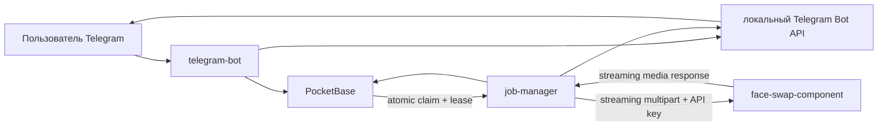

# Аудит faceswaper — 11 августа 2026

## Краткий диагноз

`main` — понятная пользовательская база декабря 2024 года: Telegram-бот, PocketBase и обработчик кружков без face swap. Текущая функциональная линия выросла поверх неё на 67 commit’ов в `dev-p`. В ней смешаны ручные итерации, экспериментальный face-swap и несколько больших «улучшающих» проходов с признаками LLM-генерации.

Основная проблема была не в одном неудачном файле, а в нарушении межсервисных инвариантов: задача выбиралась неатомарно, деньги менялись несколькими PATCH, статус завершался до доставки, большие файлы неоднократно целиком собирались в RAM, а compose и документация описывали другую систему.

Рабочая восстановительная ветка: `codex/rebuild-main-style`.

## Карта веток

| Ветка | База относительно `main` | Уникальных commit’ов | Назначение / состояние |
|---|---:|---:|---|
| `main` | `8ae2fc7` | 0 | Пользовательская стабильная база без face swap. Тоже содержит старые баги, но остаётся эталоном UX и простоты. |
| `origin/face-swap-pre-stable` | `8ae2fc7` | 25 | Первое работающее ответвление face swap; историческая ступень, не цель для merge. |
| `dev-p` | `8ae2fc7` | 67 | Наиболее полная функциональная линия; выбрана исходной точкой восстановления. |
| `dev-o` | `8ae2fc7` | 73 | Ответвилась от общего `5cb1cd4`; содержит семь дополнительных больших «safety/reliability» проходов. Не использовать: часть исправлений поверхностна или создаёт новые расхождения. |
| `actioms` | `8ae2fc7` | 4 | Старый эксперимент публикации образов/registry. Исторически поглощён более поздним CI. |
| четыре `review-and-improve-...` | commit `7fec6e0` | одинаковые | Локальные AI-worktree, ошибочно записанные как gitlink без `.gitmodules`. Убраны из индекса, локальные каталоги сохранены. |

`dev-p` и `dev-o` имеют общий последний commit `5cb1cd4` от 19 декабря 2025. После него в `dev-p` один commit (`b972d6e`), а в `dev-o` семь commit’ов, изменяющих десять ключевых файлов на 635 добавленных/342 удалённых строки.

## Что можно сказать об авторстве

Git не содержит меток Sonnet/Haiku или `Co-authored-by`. Все 67 commit’ов `main..dev-p` записаны под двумя вашими идентичностями:

- `soaska <79996669747@yandex.com>` — 56 commit’ов;
- `Alex Borisov <soaska@cornspace.su>` — 11 commit’ов.

Поэтому точно разделить «ваш код» и «код модели» по metadata невозможно. Можно сделать обоснованную классификацию:

- высокая уверенность в ручном происхождении: `main`, ранние короткие итерации face swap и commit’ы с конкретными симптомами (`nvidia build first`, `path`, `ffmpeg fix`, `403 temp fix`, сообщения на русском и короткие проверочные шаги);
- высокая вероятность LLM-прохода: крупные conventional commits с исчерпывающими англоязычными списками и одновременной переделкой нескольких компонентов, например `c4985bf`, `88867de`, `87a05ce`, `5dc8ecd`, а также линия `dev-o`: `8ff5053`, `9b55150`, `7fec6e0` и последующие «minor improvements»;
- смешанная зона: commit’ы, где модель, вероятно, предложила патч, а вы вручную доводили runtime (`um eh ok?`, серии CUDA/path/cleanup/ffmpeg fixes).

Практический вывод: надёжнее классифицировать не автора строк, а подтверждённые инварианты. В восстановительной ветке критические пути переписаны и покрыты тестами независимо от происхождения старого кода.

## Архитектура после восстановления

Нормальный lifecycle: `queued → processing → sending → completed`. Claim и lease выполняются внутри транзакции PocketBase. Баланс меняется через уникальный журнал операций. `completed` устанавливается только после успешного ответа Telegram.

## Найдено и исправлено

### Очередь и деньги

- GET/PATCH race заменён атомарным claim route.
- Добавлены `claimed_by`, `lease_until`, `attempts`, heartbeat и recovery просроченных задач.
- Баланс и счётчики меняются транзакционно и идемпотентно; отрицательный баланс запрещён.
- Убрано двойное увеличение `circle_count`.
- Цена видео ограничена 30 монетами.
- Charge key теперь привязан к job, а не к attempt: аварийный retry не списывает повторно.
- Списание происходит после успешной обработки; до неё проверяется минимальный баланс.

### Telegram

- Команды разбираются точно, без `strings.Contains`.
- Убраны небезопасные assertions из произвольного JSON.
- Polling получил context/backoff и перестал зависеть от непрозрачного channel helper.
- Добавлен `request_key`, защищающий создание задач при повторной доставке update.
- Ожидаемое фото лица хранится в PocketBase с TTL и переживает restart.
- `/status` разбивается по лимиту Telegram и не ломается на больших очередях.
- Контракт `main` сохранён отдельными тестами: приветствие/справка, формат статуса, начальные 200 монет, нулевые счётчики, `queued` и обязательные поля job. Новые face-swap пункты добавлены в тот же пользовательский стиль.
- Создание пользователя снова отправляет ровно пять исходных полей `main` (`tgid`, `username`, два счётчика и 200 монет), а не сериализует внутренний record/session целиком.
- Ошибки закрытия и удаления файлов компрессора больше не проглатываются; после ошибки чтения пользователь получает ответ вместо вечного состояния «Обрабатываю…».
- Технические startup/version логи снова простые, без интерфейсных emoji; основной env-ключ приведён к `FACE_SWAP_URL` с fallback старого AI-имени `FaceSwapComponent_URL`.

### Face swap и файлы

- Удалены массивы всех кадров/chunks: в памяти находится только текущий кадр.
- Удалены ненужные Torch/TorchVision и ошибочные BGR↔RGB преобразования.
- API требует `FACE_SWAP_API_KEY`, ограничивает размер/длительность/разрешение и обрабатывает одну тяжёлую задачу одновременно.
- Результат возвращается прямым file stream, затем потоково идёт в PocketBase и Telegram.
- Если в target не найдено ни одного лица, задача отклоняется, а неизменённый файл не выдаётся как платный результат.
- Исправлен скрытый runtime-регресс: analyzer, загруженный только с `detection`, находил лицо, но не создавал `normed_embedding`, обязательный для INSwapper. Теперь явно загружаются `detection` и `recognition`.
- ONNX Runtime получает явное число worker-потоков. Это отключает ошибочную автоматическую CPU affinity на хосте с разреженным cpuset и убирает поток ошибок `pthread_setaffinity_np`.
- Временные файлы удаляются после каждой задачи; FFmpeg получает timeout, context и `-y` для crash retry.
- `inswapper_128.onnx` берётся из официального release и проверяется SHA-256.

### Схема и deployment

- PocketBase обновлён внутри совместимой ветки с 0.22.27 до 0.22.47; Linux archive проверяется SHA-256.
- Добавлены required-поля, уникальный `users.tgid`, целочисленные неотрицательные балансы/счётчики и индексы очереди.
- Удалён устаревший ручной `PB Schema.json`; единственный источник схемы — миграции.
- Исправлены несуществующий CPU build target, неверные `/app/temp`, healthcheck без `curl`, внутренние адреса `0.0.0.0` и mount, скрывавший встроенную swap-модель.
- `restart: always` заменяет проблемный для данного инцидента `unless-stopped`.
- Порты управления публикуются только на `127.0.0.1`.
- Telegram Bot API image закреплён linux/amd64 digest, но может быть явно переопределён.
- CUDA runtime приведён к минимально совместимой с Blackwell конфигурации: CUDA 12.8.1, cuDNN 9 и ONNX Runtime GPU 1.23.2 (последняя подходящая версия с Python 3.10 wheel).
- Добавлен изолированный deployment `/opt/faceswaper-codex-test`: отдельное имя compose-проекта, loopback-порты и каталоги данных; Telegram poller вынесен в opt-in profile.
- Переданный на сервер `.env` получает `0600` и владельца remote deploy-user (`root:root` на `gpu-box`); локальный файл пользователя не изменяется.
- Git SHA проходит через generated env и compose build args во все runtime-образы. Startup-логи объявляют сервис запущенным только после успешной конфигурации/авторизации и не дублируют PocketBase success.
- Слой загрузки swap-модели расположен до `COPY` исходников, поэтому обычные изменения Python больше не инвалидируют большой model layer.

### CI и supply chain

- Удалена shell-интерполяция commit message/branch name рядом с registry secret.
- Ветки и PR только тестируют/собирают; publish выполняется только из `main`.
- Go поднят до 1.26.5. `govulncheck` для обоих модулей: `No vulnerabilities found`.
- Полный Python graph (60 пакетов) закреплён отдельными CPU/GPU lock-файлами. `pip-audit`: `No known vulnerabilities found`.

## Промежуточные commit’ы восстановления

1. `230a7a1` — инварианты биллинга/lifecycle.
2. `36dc1e0` — атомарные PocketBase операции.
3. `8e95fd3` — lease-based job-manager.
4. `3775ece` — восстановимый Telegram polling/session.
5. `82614b0` — bounded-memory streaming face swap.
6. `294a48b` — schema/compose/health contracts.
7. `7a9707e` — streaming delivery, retry-safe billing, безопасный CI.
8. `20e28e1` — runtime cleanup, cancellation, target-face validation.
9. `ff9ba23` — проверенные и закреплённые runtime dependencies.
10. `f3e4889` — карта веток, авторства и остаточных рисков.
11. `aae2ad7` — восстановление пользовательских/data-контрактов `main`.
12. `75ff2cc`–`537c4ff` — изолированный GPU deployment, переносимость rsync и восстанавливаемый bootstrap PocketBase.
13. `8334729`–`057e09c` — совместимый Blackwell CUDA/Python/InsightFace image.
14. `7db1002` — управляемые ONNX worker threads без ошибочной affinity.
15. `1f70371` — обязательный recognition embedding для реального face swap.
16. `11d7719` — стабильный Docker cache для ONNX-модели.
17. `d15813c`, `7eff9b4` — режим `0600` и корректный владелец remote `.env`.
18. `9bd48f0`, `ecb6bc6` — проверяемый Git SHA в образах без инвалидирования model cache.
19. `aada7ac` — правдивый и недублирующийся startup/auth log.
20. `bea083f` — точный payload `main` и обработка ошибок компрессора.
21. `df844f0` — UTF-8 безопасная обрезка русских error-status.

## Выполненные проверки

- `go test ./...`, `go test -race ./...`, `go vet ./...`, `go build` для обоих Go-компонентов.
- Те же проверки exact toolchain Go 1.26.5.
- `govulncheck ./...` для обоих компонентов под Go 1.26.5.
- `py_compile` и unit-тесты bounded-memory pipeline.
- `pip-audit` полного CPU lock.
- fresh migrations и реальные hooks на PocketBase 0.22.47:
  - missing/duplicate `tgid` → 400;
  - неполная задача → 400;
  - atomic claim → одна задача;
  - повтор charge operation не меняет баланс второй раз.
- полная, CPU и NVIDIA compose-конфигурации проходят parser.
- изолированный core-стек развёрнут на `root@gpu-box` в `/opt/faceswaper-codex-test`; production-каталоги и контейнеры других проектов не изменялись;
- PocketBase admin bootstrap проверен реальной HTTP-авторизацией, job-manager после старта успешно авторизуется и опрашивает очередь;
- NVIDIA runtime видит RTX 5080 (Blackwell, compute capability 12.0), а все модели применяют `CUDAExecutionProvider` с CPU fallback;
- runtime health и job-manager log показывают реальный SHA `df844f0…`; порядок лога подтверждён как `PocketBase auth → Job Manager запущен → Версия → Воркер`;
- remote `.env` проверен как `0600 root:root`;
- реальный `POST /swap-photo` после CUDA-прогрева возвращает `200 image/jpeg`; результат размером 259923 байта декодирован OpenCV как `1280×886×3`;
- первый прогрев inference занял 54 секунды, повторный запрос — 3 секунды; после обоих запросов временный media-каталог пуст;
- финальный regression suite: оба Go-компонента проходят `go test`, `go test -race` и `go vet`; Python — 6 тестов и `py_compile`; четыре compose-варианта валидны.

## Остаточные риски и ограничения

1. **Лицензия моделей.** Код InsightFace — MIT, но предоставляемые pretrained-модели заявлены только для non-commercial research. Для коммерческого бота требуется отдельно лицензированная модель/разрешение.
2. **Telegram delivery не может быть строго exactly-once.** Авария после успешного `sendVideo/sendPhoto`, но до записи `completed` может привести к повторной отправке после lease recovery. Финансовое списание при этом не повторится.
3. **Высокие права сервисов.** Бот и воркер используют PocketBase admin token. Hooks закрыты admin auth, но долгосрочно лучше выдать отдельные service credentials/минимальные правила.
4. **InsightFace 0.7.3 старый.** Его graph закреплён и просканирован, но реальный CUDA/model smoke-test обязателен при каждом обновлении lock.
5. **Production migration требует preflight.** Уникальный индекс `users.tgid` намеренно остановит миграцию при старых дубликатах; данные нельзя автоматически удалять или сливать без решения владельца.
6. **Локальный Telegram API image сторонний.** Digest фиксирует проверяемую сборку, но проект `aiogram/telegram-bot-api` не является официальным образом Telegram.

## Оставшийся Telegram E2E

Нужный хост подтверждён как `root@gpu-box`; core-стек на нём проверен. Ни Docker-, ни Podman-production poller faceswaper на этом хосте сейчас не обнаружен. Telegram poller тестового стека намеренно не запущен: текущий `.env` содержит реальный bot token, а запуск может забрать накопленные updates или конфликтовать с consumer на другом хосте.

Для безопасного последнего E2E нужен либо отдельный test bot token, либо явное разрешение на короткий polling cutover с текущим токеном. После этого тест состоит из запуска profile `telegram-e2e`, команды в Telegram Web, прохождения `queued → processing → sending → completed` и проверки полученного изображения.
